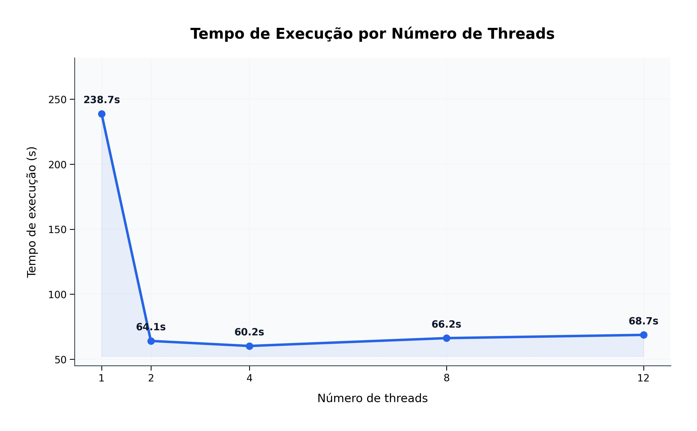
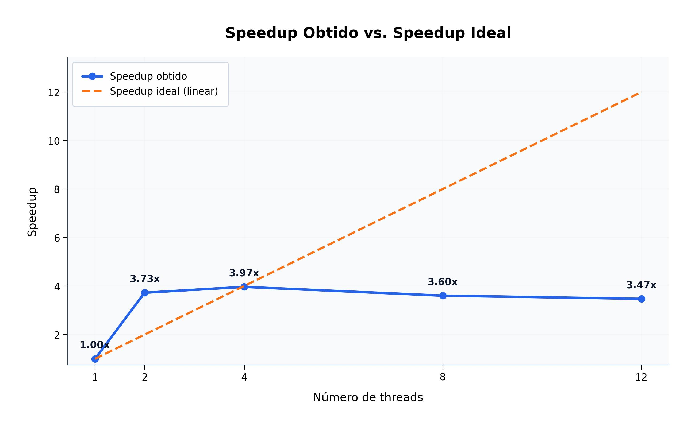
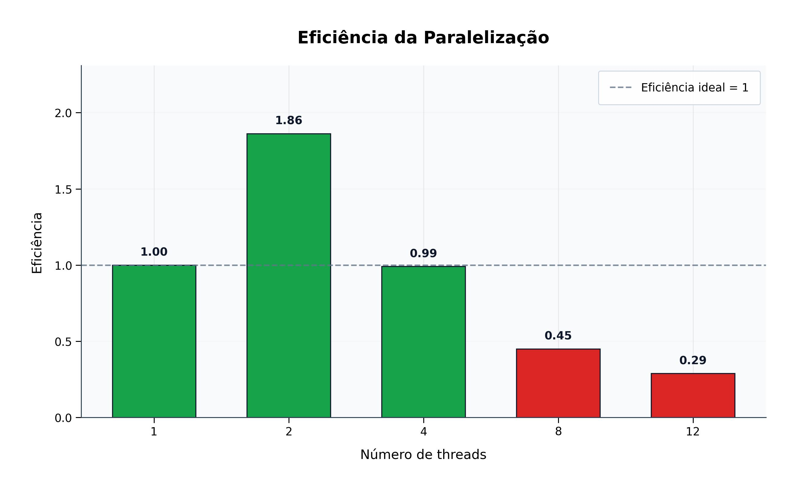

# 🚗 Detector Paralelo de Placas Veiculares


**Disciplina:** Programação Concorrente e Distribuída  
**Alunos:** Samuel de Souza Rodrigues · Kaio Kevin  
**Turma:** 5º Semestre — ADS  
**Professor:** Rafael Marconi  
**Data:** 01/06/2026

---

## Dataset

As imagens utilizadas nos testes não são armazenadas diretamente neste repositório para evitar que o clone fique pesado.

📥 [Baixar dataset](https://github.com/samucabsb/uni-project-stolen-vehicles/releases/download/dataset-v1.0/placas-20260601T192527Z-3-001.zip)

Após baixar, extraia o conteúdo para:

```text
data/input/
```

## 1. Descrição do Problema

O projeto implementa um sistema de **reconhecimento automático de placas veiculares** em lote. O programa recebe imagens de veículos, detecta a região da placa com **YOLO v8 em formato ONNX**, recorta a placa detectada e realiza a leitura textual utilizando **fast-plate-ocr**. Em seguida, a placa reconhecida é comparada com uma lista local de veículos roubados.

> **Nota sobre a versão atual (v11):** as seções abaixo (incluindo a tabela de
> resultados) documentam um experimento feito com a arquitetura anterior
> (v10.x), em que apenas o OCR era paralelizado via `ThreadPoolExecutor`
> enquanto o YOLO rodava inteiramente no processo principal — por isso o
> speedup ficava limitado pela Lei de Amdahl bem antes de saturar os núcleos.
> A versão atual paraleliza o pipeline **completo** (YOLO + OCR) via
> `concurrent.futures.ProcessPoolExecutor`: cada processo carrega seu próprio
> YOLO e seu próprio OCR, ambos com threading interna fixada em 1 (evita
> oversubscription entre processos), e processa uma fatia completa das
> imagens do início ao fim. Há também um modo `--benchmark` (`main.py`) que
> desliga a gravação de crops/preprocessed em disco e a impressão de uma
> linha por imagem, isolando o custo de CPU (YOLO+OCR) do custo de I/O/console
> ao medir desempenho. Os números abaixo precisam ser re-coletados com a
> arquitetura atual para refletir o comportamento real do sistema.

O objetivo principal da paralelização é diminuir o tempo total de processamento do dataset, distribuindo o pipeline completo (YOLO + OCR) entre múltiplos processos por meio da biblioteca `concurrent.futures.ProcessPoolExecutor`.

### 1.1 Volume de dados processado

| Item | Valor |
|---|---:|
| Total de imagens | 2000 |
| Imagens com placa | 2000 |
| Imagens sem placa | 0 |
| Placas detectadas | 2000 |
| Taxa de detecção | 100% |
| Status OK | 2000 |
| Status ROUBADO | 0 |
| Não identificado | 0 |

### 1.2 Algoritmo utilizado

O sistema utiliza um pipeline em dois estágios:

```text
Entrada: imagens de veículos
   ↓
Estágio 1 — Detecção YOLO/ONNX
   - leitura da imagem
   - detecção da placa
   - geração do recorte da placa
   ↓
Estágio 2 — OCR com fast-plate-ocr
   - leitura dos caracteres da placa
   - normalização do texto
   - comparação com a lista de veículos roubados
   ↓
Saída: CSV, relatório HTML e métricas de desempenho
```

No modo serial, cada imagem é processada sequencialmente. No modo paralelo, as placas recortadas são enviadas para múltiplas threads, que executam a etapa de OCR de forma concorrente.

### 1.3 Complexidade aproximada

Considerando `n` imagens, `p` placas detectadas e `t` threads:

| Componente | Complexidade aproximada | Observação |
|---|---|---|
| Detecção YOLO | O(n) | Processa todas as imagens |
| OCR serial | O(p) | Uma leitura por placa |
| OCR paralelo | O(p/t) | Divisão do OCR entre as threads |
| Pipeline serial | O(n + p) | Execução sequencial |
| Pipeline paralelo | O(n + p/t) | A etapa de detecção ainda limita parte do ganho |

---

## 2. Ambiente Experimental

| Item | Descrição |
|---|---|
| Processador | 12th Gen Intel(R) Core(TM) i7-12700, 2.10 GHz |
| Número de núcleos | 12 núcleos físicos / 20 threads lógicas |
| Memória RAM | 16,0 GB instalada, 15,7 GB utilizável |
| Sistema Operacional | Windows 11 Pro 64 bits, versão 24H2, compilação 26100.8037 |
| Linguagem utilizada | Python 3.10+ |
| Biblioteca de paralelização | `concurrent.futures.ThreadPoolExecutor` |
| Detector | YOLO v8 exportado para ONNX |
| OCR | fast-plate-ocr / CCT |
| Bibliotecas principais | OpenCV, NumPy, Ultralytics, ONNX Runtime, psutil |

---

## 3. Metodologia de Testes

O tempo de execução foi medido pelo próprio programa com `time.perf_counter()`. O tempo de **warm-up** foi registrado separadamente, pois corresponde ao carregamento inicial dos modelos de detecção e OCR. Assim, a comparação considera o tempo principal de processamento das imagens.

As configurações testadas foram:

- 1 thread/processo — execução serial;
- 2 threads — execução paralela;
- 4 threads — execução paralela;
- 8 threads — execução paralela;
- 12 threads — execução paralela.

Todas as configurações processaram o mesmo conjunto de **2000 imagens**.

### 3.1 Métricas auxiliares coletadas

| Threads | Warm-up (s) | YOLO (s) | OCR acumulado (s) | Throughput |
|---:|---:|---:|---:|---:|
| 1 | 2.5555 | 241.45 | 48.82 | 5.90 |
| 2 | 2.4536 | 47.09 | 31.13 | 31.21 |
| 4 | 2.4532 | 45.80 | 53.36 | 33.23 |
| 8 | 2.3677 | 44.25 | 167.80 | 30.20 |
| 12 | 2.6063 | 45.16 | 270.61 | 29.10 |

> Observação: no modo paralelo, o tempo de OCR exibido no sumário é acumulado entre as threads. Portanto, ele representa a soma do trabalho realizado pelas threads, não necessariamente o tempo total de parede da execução.

---

## 4. Resultados Experimentais

| Nº Threads/Processos | Tempo de Execução (s) |
|---:|---:|
| 1 | 238.7392 |
| 2 | 64.0720 |
| 4 | 60.1929 |
| 8 | 66.2353 |
| 12 | 68.7171 |

---

## 5. Cálculo de Speedup e Eficiência

### 5.1 Speedup

```text
Speedup(p) = T(1) / T(p)
```

Onde:

- `T(1)` = tempo da execução serial;
- `T(p)` = tempo usando `p` threads/processos.

### 5.2 Eficiência

```text
Eficiência(p) = Speedup(p) / p
```

Onde:

- `p` = número de threads/processos.

---

## 6. Tabela de Resultados

| Threads/Processos | Tempo (s) | Speedup | Eficiência | Throughput | Redução do tempo vs. serial |
|---:|---:|---:|---:|---:|---:|
| 1 | 238.7392 | 1.000x | 1.000 (100.0%) | 5.90 img/s | 0.0% |
| 2 | 64.0720 | 3.726x | 1.863 (186.3%) | 31.21 img/s | 73.2% |
| 4 | 60.1929 | 3.966x | 0.992 (99.2%) | 33.23 img/s | 74.8% |
| 8 | 66.2353 | 3.604x | 0.451 (45.1%) | 30.20 img/s | 72.3% |
| 12 | 68.7171 | 3.474x | 0.290 (29.0%) | 29.10 img/s | 71.2% |

A melhor configuração foi obtida com **4 threads**, com tempo de **60.1929 s**, speedup de **3.966x** e redução de **74.8%** em relação ao modo serial.

---

## 7. Gráfico de Tempo de Execução



O gráfico mostra uma grande redução do tempo ao sair da execução serial para a execução paralela. O menor tempo ocorreu com **4 threads**.

---

## 8. Gráfico de Speedup



O speedup real aumenta até **4 threads** e depois diminui levemente em 8 e 12 threads, indicando perda de eficiência por overhead e contenção.

---

## 9. Gráfico de Eficiência



A eficiência é maior nas configurações com menor número de threads e cai conforme o paralelismo aumenta, especialmente em 8 e 12 threads.

---

## 10. Análise dos Resultados

O speedup obtido não foi linear. Embora o uso de threads tenha reduzido bastante o tempo de execução, o aumento do número de threads não resultou em ganho proporcional. A aplicação apresentou boa escalabilidade inicial, caindo de **238.7392 s** no modo serial para **64.0720 s** com 2 threads e **60.1929 s** com 4 threads.

A partir de 8 threads, o desempenho começou a piorar. O tempo subiu para **66.2353 s** com 8 threads e **68.7171 s** com 12 threads. Isso indica que o custo adicional de gerenciamento das threads e a disputa por recursos passaram a reduzir o benefício do paralelismo.

A eficiência começou a cair de forma mais evidente após **4 threads**. Com 8 e 12 threads, a eficiência foi de **0.451** e **0.290**, respectivamente.

As principais causas prováveis para a limitação de desempenho são:

- overhead de criação e gerenciamento das threads;
- contenção de memória e cache;
- concorrência no acesso aos arquivos intermediários;
- etapa de detecção YOLO ainda parcialmente limitante;
- aumento do trabalho acumulado de OCR conforme há mais disputa por recursos.

---

## 11. Conclusão

O paralelismo trouxe ganho significativo para o projeto. A melhor configuração foi **4 threads**, reduzindo o tempo de execução de **238.7392 s** para **60.1929 s** e alcançando speedup de **3.966x**.

Apesar do ganho expressivo, o programa não escala indefinidamente com o aumento do número de threads. A partir de 8 threads, o tempo voltou a aumentar, mostrando que há overhead e contenção de recursos.

Como melhorias futuras, recomenda-se:

- usar GPU para acelerar a detecção YOLO;
- evitar gravações intermediárias em disco, mantendo os crops em memória;
- usar um pipeline produtor-consumidor com filas;
- testar `ProcessPoolExecutor` para comparar processos e threads;
- executar múltiplas rodadas por configuração para calcular média e desvio padrão.

---

## 12. Como Executar

### 12.1 Instalação

```powershell
python -m venv .venv
.venv\Scripts\Activate.ps1
pip install -r requirements.txt
```

### 12.2 Inserir imagens

Copie as imagens para:

```text
data/input/
```

### 12.3 Execução interativa

```powershell
python main.py
```

### 12.4 Execução para benchmark

```powershell
python main.py --no-interactive --execution serial
python main.py --no-interactive --execution parallel --workers 2
python main.py --no-interactive --execution parallel --workers 4
python main.py --no-interactive --execution parallel --workers 8
python main.py --no-interactive --execution parallel --workers 12
```

Para medir o custo de CPU (YOLO+OCR) isolado do custo de I/O — sem gravar crops/preprocessed em disco, sem gerar HTML e sem imprimir uma linha por imagem — use `--benchmark`:

```powershell
python main.py --no-interactive --execution parallel --workers 4 --benchmark
```

Os parâmetros `YOLO_BATCH_SIZE` (lote interno de inferência YOLO) e `CHUNK_TARGET_IMAGES` (nº de imagens por lote enviado a cada processo) ficam em `src/config.py`, caso queira testar outros valores. `MAX_TOTAL_INFLIGHT_IMAGES` limita o nº de imagens decodificadas em memória simultaneamente em todo o sistema (lote × nº de workers) — protege contra picos de memória com muitos workers, mesmo que `YOLO_BATCH_SIZE` seja alto.

Se o speedup parar de subir bem antes do nº de núcleos físicos (ex.: já achatando em 2-4 workers numa CPU de 12 núcleos), o agendador do Windows pode estar colocando processos no mesmo núcleo físico (hyperthreading) ou migrando-os entre núcleos durante a execução. Teste fixar afinidade de CPU com `--pin-cpu` e compare:

```powershell
python main.py --no-interactive --execution parallel --workers 4 --benchmark --pin-cpu
```

---

## 13. Estrutura do Projeto

```text
uni-project-stolen-vehicles/
├── main.py
├── requirements.txt
├── README.md
├── data/
│   ├── input/
│   └── output/
│       ├── crops/
│       └── preprocessed/
├── models/
├── src/
│   ├── colors.py
│   ├── config.py
│   ├── dataset.py
│   ├── detector.py
│   ├── executor.py
│   ├── html_report.py
│   ├── logger.py
│   ├── ocr.py
│   ├── pipeline.py
│   ├── report.py
│   └── runtime.py
├── tools/
│   └── stolen.py
└── graficos/
    ├── tempo_execucao.jpg
    ├── speedup.jpg
    └── eficiencia.jpg
```

---

Projeto desenvolvido para a disciplina de **Programação Concorrente e Distribuída**.
